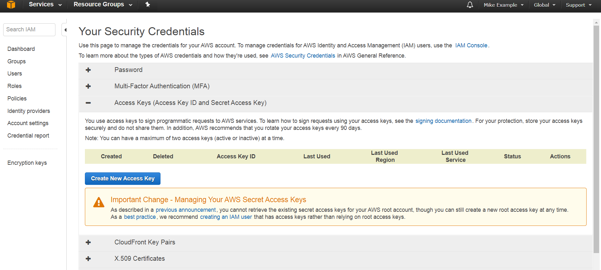
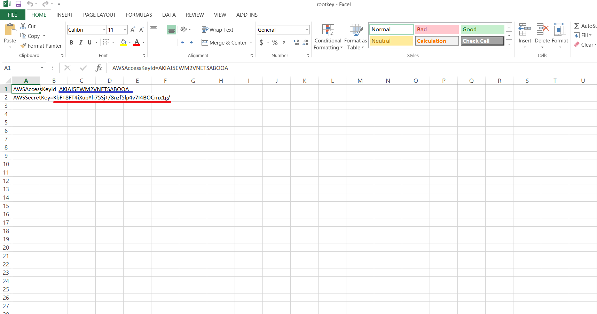
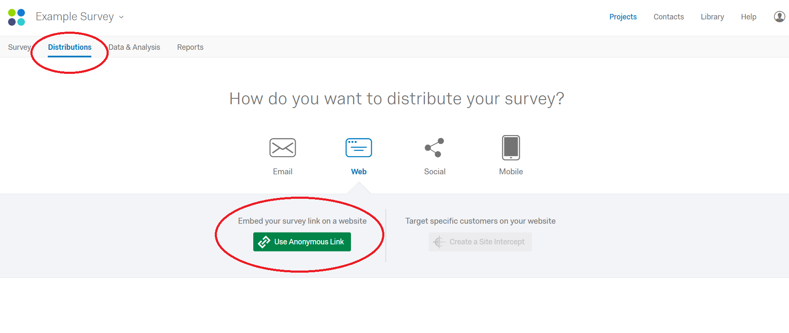
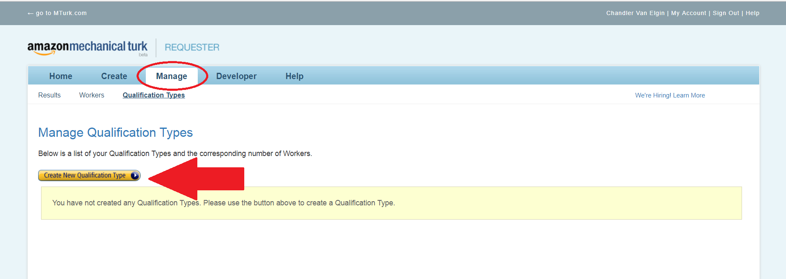
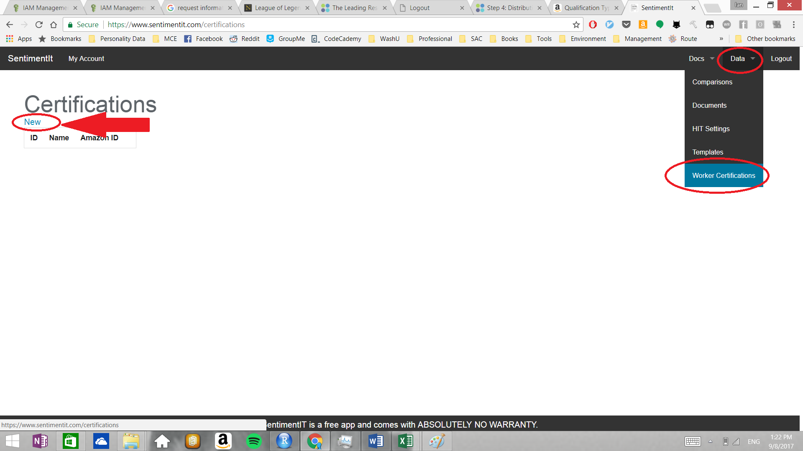
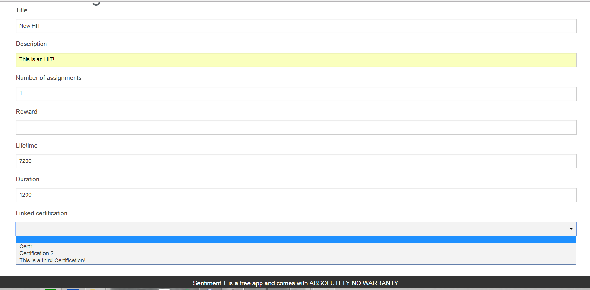

##Amazon Web Services and MTurk Requester Accounts

If you are completely new, go [here](http://docs.aws.amazon.com/AWSMechTurk/latest/AWSMechanicalTurkGettingStartedGuide/SetUp.html#accountsetup) and follow steps 1-3. This will walk you through the steps of creating a AWS account and linking it to a mturk requester account. If you already have a AWS account, you may skip step 1. 

Once you have created your AWS and mturk requester accounts, log in to the [AWS Management Console](aws.amazon.com).

##SentimentIt Account

You will now need your AWS security keys. In step 1 of account creation, you should have saved your security credentials to a file called ''rootkey.csv''. If you did not, you can create a new set of security credentials: 

-Go to the menu at top-right, go to the drop down menu under your name, and select ''Security Credentials''

-Select ''Continue to Security Credentials'' 

-Select ''Access Keys''

-Click ''Create New Key''

-Download the key file or copy-paste the values into a text document. 

Next, create a SentimentIt account [here](https://www.sentimentit.com). There will be two fields, ''Mturk access key'' and ''Mturk secret key,'' in which you input the information you just downloaded into your ''rootkey.csv'' file. This will link your Amazon account to the SentimentIt system.

##Starting a New Analysis 

When you want to start a new analysis, if you wish to require a certification follow the instructions under the QualtricsCertification folder above. Name the banned and passed certifications something meaningful and remember the names.

Once you have the distribution link for the survey (Go to ''Distributions'', then either select ''Email'' > ''Get a Reusable Link'' or ''Web'' > ''Use Anonymous Link''): 

Navigate to the MTurk requestor, Manage, Qualifications tab, and click on Create New Qualification Type. 

Name the qualification something simple and easily understood by workers. In the description field, enter a brief description, and include the link for the Qualtrics survey so workers can find the certification / training module. An ID will be generated. You will need this on the SentimentIt GUI. Do this a second time for the banned certification, with a different name and description.

Next, on the SentimentIt GUI go to Data => Worker Certifications. Create a new certification. Name this cerification the name of the passed certification used in the Qualtrics JavaScript, and include the Amazon ID retrieved from the last step. Again, do this a second time for the banned certification, naming it the same as in the JavaScript and using the appropriate Amazon ID.

Next, create a HIT setting on the SentimentIt GUI under Data => HIT Settings. Use an informative title, and describe the task, again putting the Qualtrics link in the description. Number of assignments should be set to 1, the reward is the money you will pay for each HIT, the Lifetime is how long, in seconds, the HITs will stay up on MTurk, and the Duration, again in seconds, is how long the worker will have to complete the tasks. If the Lifetime or Duration is too short the HITs will not be posted. We usually do 7200 seconds for the Lifetime and 1200 seconds for the Duration. Make a note of the Lifetime, as this will be useful when using the R package. For Linked Certification, you should see a drop-down menu with all the certifications you have put into the SentimentIt GUI. 

The new HIT setting will show up on the GUI. Moving forward, all that will now be needed is the HIT setting ID. You can begin using the R package or follow the documentation and use the API using any programming language you want including through the terminal. When you have completed your tasks, it may be a good idea to take the qualification survey offline because the survey signs the researcher in to the system.